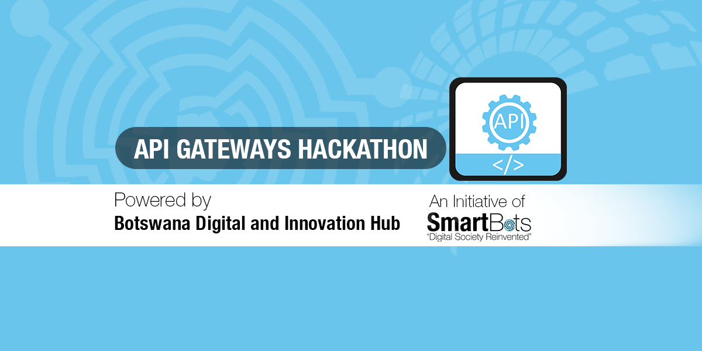
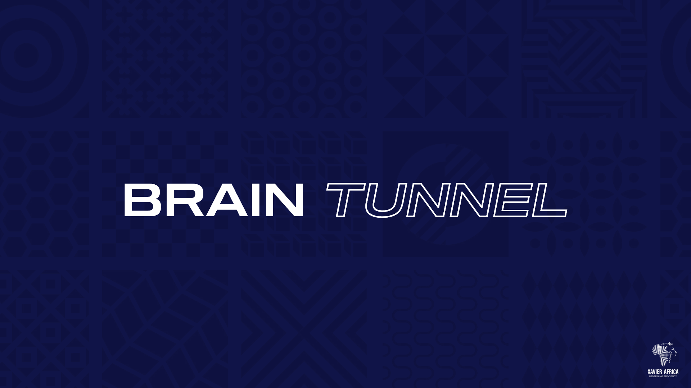
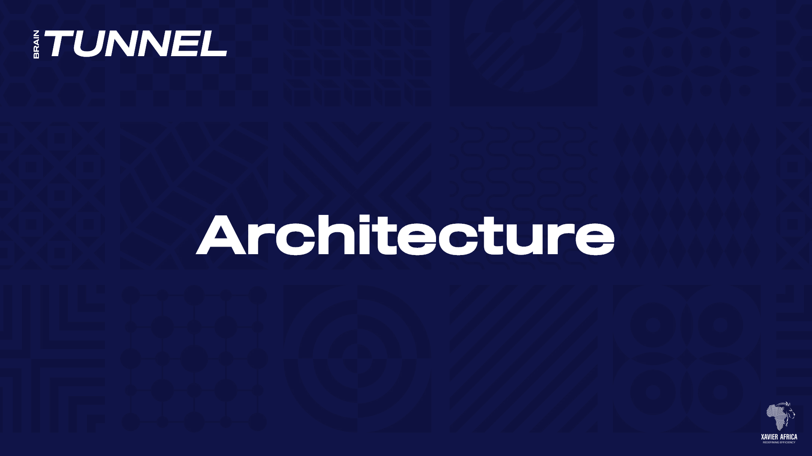
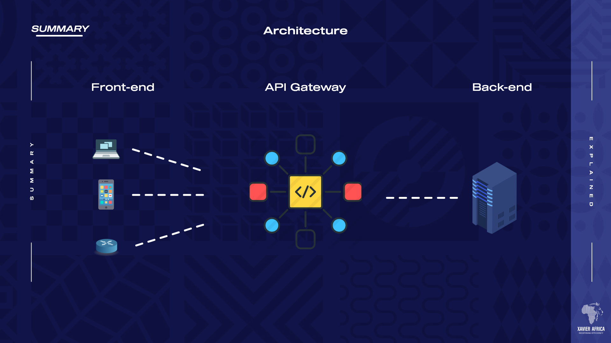

 
  

<h1 align="center">
API-Gateways-Hackathon Submission</h1>
<h3 align="center"> 
Various services across Government have their own APIs, and there is no API gateway that routes the client requests to the appropriate services.

Secondly, there has been limitations on the engagement of the developer community, innovators, and researchers. These have resulted in them not being able to discover, explore, test, register to access APIs and data sets that are free to use, reuse and redistribute. On the same note, there is no provision for IoT devices to deposit information in the centralized storage for subsequent retrieval.
Additionally, there is no centralized management of user profiles across Government services resulting in the same user having multiple profiles within government.
Therefore a best in class api gateway will be built to ensure that the security, scalability and decentralisation problems are neutralised. 
</h3>  

 

 
  

<!-- TABLE OF CONTENTS -->
<h2 id="table-of-contents"> :book: Structure</h2>

  
Table of Contents

  <ol>
    <li><a href="#problem-statement"> ➤ Problem Statement</a></li>
     <li><a href="#research"> ➤ Research</a></li>
    <li><a href="#stack"> ➤ Stack</a></li>
    <li><a href="#demo"> ➤ Demo (API Creation and Tests)</a></li>
    <li><a href="#doc"> ➤ API/Developer Docummentation</a></li>
    <li><a href="#team"> ➤ Team</a></li>
    
  </ol>

<!-- PROBLEM STATEMENT -->
<h2 id="problem-statement"> :pencil: Problem Statement</h2>

 
  Various services across Government have their own APIs, and there is no API gateway that routes the client requests to the appropriate services.

Secondly, there has been limitations on the engagement of the developer community, innovators, and researchers. These have resulted in them not being able to discover, explore, test, register to access APIs and data sets that are free to use, reuse and redistribute. On the same note, there is no provision for IoT devices to deposit information in the centralized storage for subsequent retrieval.
Additionally, there is no centralized management of user profiles across Government services resulting in the same user having multiple profiles within government.
Therefore a best in class api gateway will be built to ensure that the security, scalability and decentralisation problems are neutralised. 

<!-- analytics-->
<h2 id="research"> 📋: Research Findings</h2>

<!-- _Developer Documentation. Please refer to the [Link](https://documenter.getpostman.com/view/12221940/UVC2GTyP)_ -->

 
  Findings
  

 
Our research process was focused on finding best practices for API gateway implementation and deployment. we did this by doing a deep dive into large multinational corporations, digitized governments as well as dove into literature to discover insights from academics. this led us to exploring the largest use cases for API gateways and the key features we found across most of these organizations included; 

1.	Centralized authentication and authorization across all microservices
2.	Centralized security and HTTPs access control monitoring
3.	response caching to minimize total number of API requests
4.	load balancing across platforms
5.	centralized troubleshooting and API management
6.	Service discovery
7.	API monetization

We then looked at these various use cases but organizations across the world have tested and used and decided to explore how they would be able to solve the problems that the government is facing. therefore, in context of the current status quo the services that the API gateway we’re proposing will perform include; 

1.	Centralized authentication and authorization across all microservices
2.	Centralized security and HTTPs access control monitoring
3.	Response caching to minimize total number of API requests
4.	Load balancing across platforms
5.	Centralized troubleshooting and API management

This is demonstrated by our demo and as seen below with the video showing the architecture proposed for this purpose. 

Lessons Learned

The key lessons learnt over the period include; 

1.	The implementation of an effective API gateway requires a modular architecture to ensure scalability across services 
2.	Implementation of a centralized security protocol will ensure minimization of remote risk and with a monitoring panel we can ensure that additional 
3.	When dealing with an API Gateway you need to think about the API Gateway request/response as separate to the integration request/response. A request to API Gateway gets transformed into an integration request and when responding the integration response gets transformed into an API Gateway response. All requests to Lambdas need to be made using the POST method (regardless of what you’re accepting through API Gateway), so don’t try integrating with your Lambda using GET or PUT. 

 
 
 <!-- <a href="https://docs.google.com/presentation/d/1q1V6qgiDrBObpEXmhjADp2QHiK-3EmuLFjKhTeyLwk0/edit?usp=sharing"> ➤ Design Thinking</a> -->

 

<!-- PREREQUISITES -->
<h2 id="stack"> :computer: Stack</h2>

<!--This project is written in Python and Javascript  -->
The stack used to build this project:
* Nodejs(endpoints)
* Postman(Testing & creating Developer Docummentation)

<!-- analytics-->
<h2 id="doc"> 📋: Demo  </h2>

_Architecture Demonstration . Please refer to the [Link](https://youtu.be/TU-ylUORo4c)_

 
  API Architecture
  

 
  

 
  

 
  

 
 
 <!-- <a href="https://docs.google.com/presentation/d/1q1V6qgiDrBObpEXmhjADp2QHiK-3EmuLFjKhTeyLwk0/edit?usp=sharing"> ➤ Design Thinking</a> -->

 

<!-- analytics-->
<h2 id="doc"> 📋: Developer Documentation </h2>

_Developer Documentation. Please refer to the [Link](https://documenter.getpostman.com/view/12221940/UVC2GTyP)_

 
  Developer Documentation
  
<!-- 
 
  

 -->
<!-- 
 
  

 -->

 
  

 
 
 <!-- <a href="https://docs.google.com/presentation/d/1q1V6qgiDrBObpEXmhjADp2QHiK-3EmuLFjKhTeyLwk0/edit?usp=sharing"> ➤ Design Thinking</a> -->

 

<!-- analytics-->
<h2 id="team"> 📋: Team-Xavier Africa</h2>

 
<table>
  <tr>
   <td align="center"><a href="https://github.com/identicons/jasonlong.png"> <b>Leloba</b></a> <a href="#eventOrganizing-lolo" title="Project Setup">📋</a> <a href="#example-lolo" title="Code">💻</a></td>
<td align="center"><a href="https://github.com/kesbeast23"> <b>Kesego</b></a> <a href="#eventOrganizing-Kesego23" title="Event Organizing">📋</a> <a href="#example-Kesbeast23" title="Documentation">📖</a> <a href="#example-kesbeast23" title="Code">💻</a></td>
<td align="center"><a href="https://github.com/identicons/jasonlong.png"> <b>Thabang</b></a> <a href="#eventOrganizing-lolo" title="Project Setup">📋</a> <a href="#example-lolo" title="Code">💻</a></td>
<td align="center"><a href="https://github.com/identicons/jasonlong.png"> <b>Duduetsang</b></a> <a href="#eventOrganizing-thabang" title="Project Setup">📋</a> <a href="#example-Dudu" title="Code">💻</a></td>
    <td align="center"><a href="https://github.com/identicons/jasonlong.png"> <b>Withus</b></a> <a href="#eventOrganizing-withus" title="Project Setup">📋</a> <a href="#example-withus" title="Code">💻</a></td>
    <td align="center"><a href="https://github.com/identicons/jasonlong.png"> <b>Letso</b></a> <a href="#eventOrganizing-letso" title="Project Setup">📋</a> <a href="#example-Letso" title="Code">💻</a></td>
  </tr>
</table>

 

<!-- tutorial-->
<h2 id="tut"> :computer: How to get Started </h2>

1. Fork this repository
`https://github.com/Xavier-Botswana/API-GATEWAYS-HACKATHON.git`
2. Clone your fork down to your local machine
`git clone https://github.com/YOUR-NAME/API-GATEWAYS-HACKATHON.git`
get into the directory
`cd internshiphack`
3. Create a branch
`git checkout -b branch-name`
preferrably `feature-you-are-working-on`
4. Make your changes (choose from any task given)
5. Add all your changes to be tracked by git 
`git add .`
6. Commit your changes
`git commit -m 'commit message'`
7. Push your changes
`git push origin branch-name`
preferably develop branch
8. Create a new pull request from your forked repository (Click the New Pull Request button located at the top of your repo)
9. Wait for your PR review and merge approval!
10. Star this repository if you had fun!
11. Check your changes by clicking here 

